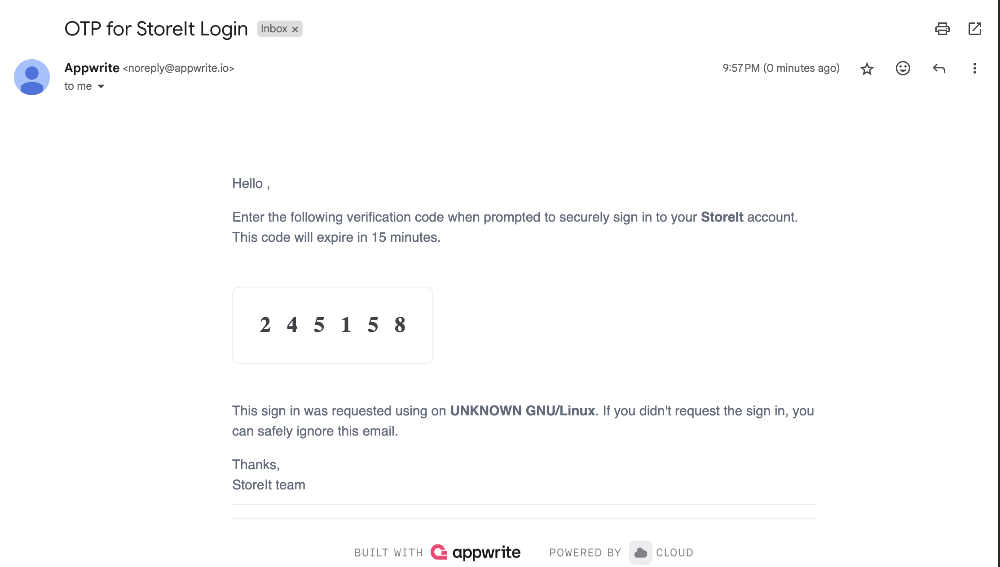
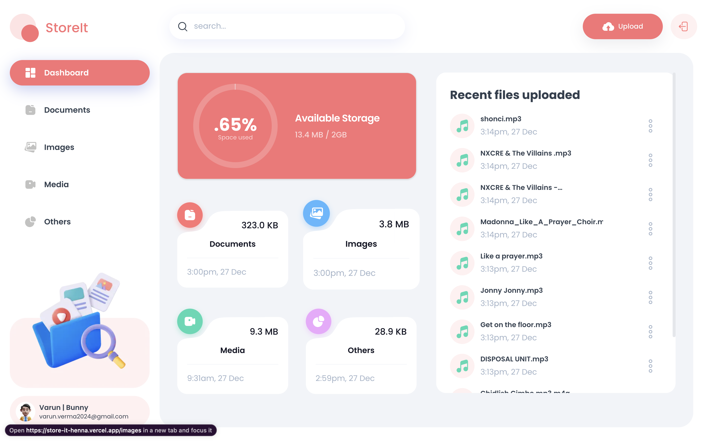

# StoreIt - The only storage solution you need

---

## Introduction

- A storage management and file sharing platform that lets users effortlessly upload, organize, and share files. Built with the latest Next.js 15 and the Appwrite Node SDK, utilizing advanced features for seamless file management.
- Credentials used for dev:
  - varun.verma2024@gmail.com (OTP will be sent)

## Tech Stack

- React 19
- Next.js 15
- Appwrite
- TailwindCSS
- ShadCN
- TypeScript

## Features

- User Authentication with Appwrite: Implement signup, login, and logout functionality using Appwrite's authentication system.

- FIle Uploads: Effortlessly upload a variety of file types, including documents, images, videos, and audio, ensuring all your important data.

- View and Manage Files: Users can browse through their uploaded files stored in Appwrite storage, view on a new tab, rename file or delete.

- Download Files: Users can download their uploaded files giving them instant access to essential documents.

- File Sharing: Users can easily share their uploaded files with others, enabling collaboration and easy access to important content.

- Dashboard: Gain insights at a glance with a dynamic dashboard that showcases total and consumed storage, recent uploads, and a summary of files grouped by type.

- Global Search: Users can quickly find files and shared content across the platform with a robust global search feature.

- Sorting Options: Organize files efficiently by sorting them by date, name, or size, making file management a breeze.

- Modern Responsive Design: A fresh and minimalist UI that emphasizes usability, ensuring a clean aesthetic across all devices.

and many more, including the latest React 19, Next.js 15 and Appwrite features alongside code architecture and reusability

## Project ScreenShots

